# 🏦 LendIQ - AI-Powered Loan Verification System

> An intelligent, automated loan verification platform powered by AWS Bedrock, multi-agent orchestration, and advanced document forensics.

[](https://www.python.org/)
[](https://reactjs.org/)
[](https://fastapi.tiangolo.com/)
[](https://aws.amazon.com/bedrock/)

## Overview

LendIQ is a comprehensive loan verification system that leverages AI agents to automate the end-to-end loan application review process. It combines document tampering detection, cross-validation, account aggregator verification, and intelligent decision-making to streamline loan approvals.

### Key Features

- **Document Tampering Detection**: ResNet50 + ELA + Noise Analysis with GradCAM heatmaps
- **Multi-Document Cross-Validation**: Automated verification across payslips, offer letters, bank statements, and Form16
- **Account Aggregator Integration**: Real-time financial data verification using AA framework
- **AI Decision Agent**: AWS Bedrock-powered intelligent loan decision making
- **Risk Assessment**: DTI ratio calculation, loan eligibility, and risk tiering
- **Cloud-Native**: S3 storage, serverless processing, no local file clutter
- **Modern UI**: React-based dashboard with Material-UI components
- **Real-Time Analytics**: Track applications, escalations, and approved loans

##     Quick Start

### Prerequisites

- Python 3.11 or higher
- Node.js 18 or higher
- AWS Account with Bedrock access
- Poppler (for PDF processing)

### Installation

1. **Clone the repository**
```bash
git clone <repository-url>
cd Python
```

2. **Install Python dependencies**
```bash
pip install -r requirements.txt
```

3. **Install Poppler (Windows)**
```bash
# Download from: https://github.com/oschwartz10612/poppler-windows/releases/
# Extract to: C:\Program Files\poppler\
# Add to PATH: C:\Program Files\poppler\Library\bin\
```

4. **Configure AWS credentials**
```bash
# Create .env file in project root
echo AWS_ACCESS_KEY_ID=your_access_key > .env
echo AWS_SECRET_ACCESS_KEY=your_secret_key >> .env
echo AWS_REGION=us-east-1 >> .env
echo S3_BUCKET_NAME=documents-loaniq >> .env
```

5. **Install frontend dependencies**
```bash
cd frontend
npm install
```

### Running the Application

**Terminal 1 - Start Backend:**
```bash
cd backend
python main.py
```
Backend runs on: `http://localhost:8000`

**Terminal 2 - Start Frontend:**
```bash
cd frontend
npm run dev
```
Frontend runs on: `http://localhost:3000`

## Project Structure

```
Python/
├── README.md                     # This file
├── SETUP.md                      # Detailed setup guide
├── requirements.txt              # Python dependencies
├── .gitignore                    # Git ignore rules
├── .env                          # Environment variables (not in repo)
│
├── backend/
│   ├── main.py                   # FastAPI server
│   └── requirements.txt          # Backend dependencies
│
├── frontend/
│   ├── src/
│   │   ├── App.jsx              # Main application
│   │   ├── HomePage.jsx         # Dashboard homepage
│   │   ├── ApprovedLoansPage.jsx
│   │   └── HumanEscalationPage.jsx
│   ├── package.json
│   └── node_modules/
│
├── orchestration_strands.py      # Workflow orchestrator
├── da_strands.py                 # Document analyzer agent
├── cv_strands.py                 # Cross-validation agent
├── agent_strands.py              # Account aggregator agent
├── decision_agent_strands.py     # Decision making agent
│
└── Documents/                    # Local temp storage (gitignored)
```

## Core Components

### 1. Document Analyzer Agent (`da_strands.py`)
- **ResNet50 Model**: Pre-trained CNN for image classification
- **Error Level Analysis (ELA)**: Detects JPEG compression artifacts
- **Noise Residual Analysis**: Identifies inconsistencies in image noise
- **GradCAM Visualization**: Generates heatmaps highlighting suspicious regions
- **Ensemble Scoring**: Combines multiple techniques for accuracy

### 2. Cross-Validation Agent (`cv_strands.py`)
- Payslip ↔ Offer Letter validation
- Bank Statement ↔ Payslip verification
- Payslip ↔ Form16 tax consistency check
- Name, salary, and tax reconciliation

### 3. Account Aggregator Agent (`agent_strands.py`)
- Verifies PAN, UAN, account numbers
- Cross-checks financial data with AA framework
- Validates income, tax, and loan obligations

### 4. Decision Agent (`decision_agent_strands.py`)
- AWS Bedrock LLM integration (Claude)
- Calculates DTI ratio and loan eligibility
- Generates loan plans with multiple tenure options
- Risk assessment and final decision

### 5. Orchestration Layer (`orchestration_strands.py`)
- Multi-agent workflow management
- Parallel and sequential execution
- State management and error handling
- S3 upload/download coordination

##  Agentic Workflow

The system uses a **multi-agent orchestration** approach with parallel and sequential execution:

```
START
  |
  |─► doc_analyzer ──────┐
  |    (Parallel)        |
  |                      |
  └─► cross_validator ───┤
       (Parallel)        | 
       |                 |
       ▼                 |
    aa_agent ────────────┤
    (Sequential)         |
                         ▼
                   decision_agent
                    (Sequential)
                         |
                         |
                         ▼
                       END
```

### Execution Flow:

1. **Parallel Execution (Node 1 & 2)**:
   - **Document Analyzer**: Detects tampering using ResNet50 + ELA + Noise Analysis
   - **Cross Validator**: Validates data across payslip, offer, bank statement, Form16

2. **Sequential Execution (Node 3)**:
   - **AA Agent**: Verifies financial data from Account Aggregator (triggered after cross-validation)

3. **Sequential Execution (Node 4)**:
   - **Decision Agent**: AWS Bedrock LLM analyzes all agent results and makes final decision

4. **Sequential Execution (Node 5)**:
   - **Finalizer**: Combines all results, saves to S3, updates application lists

### Decision Outcomes:

```mermaid
graph LR
    A[Decision Agent] --> B{Decision}
    B -->|Approved| C[✅ Approved Loans]
    B -->|Needs Review| D[⚠️ Human Escalation]
    B -->|Rejected| E[❌ Rejected]
```



## User Interface

### Dashboard
- **New Applicants**: View and process pending applications
- **Human Escalations**: Review flagged cases
- **Approved Loans**: Track approved loan IDs

### Application Review
- Document upload status
- Tampering detection results with GradCAM heatmaps
- Cross-validation report
- AA verification status
- Final decision with loan plans

## 🔐 Security & Privacy

- ✅ AWS credentials stored in `.env` (gitignored)
- ✅ Documents stored in S3 with encryption
- ✅ No sensitive data in repository
- ✅ GradCAM images uploaded directly to S3
- ✅ Temporary files cleaned after processing
- ✅ CORS configured for secure API access

## 📈 API Endpoints

### Customer Management
```
GET  /customers                    # List all loan applications
POST /run_workflow                 # Process loan application
GET  /results/{customer_id}        # Get verification results
```

### Lists
```
GET  /approved-loans               # Get approved loan IDs
GET  /human-escalations            # Get escalated loan IDs
```

### Actions
```
POST /approve_loan                 # Approve a loan application
```

**API Documentation**: `http://localhost:8000/docs` (Swagger UI)

## 🧪 Testing

### Upload Sample Documents to S3
```bash
aws s3 cp LID1755598891411/ s3://documents-loaniq/LID1755598891411/ --recursive
```

### Test API
```bash
# List customers
curl http://localhost:8000/customers

# Run workflow
curl -X POST http://localhost:8000/run_workflow \
  -H "Content-Type: application/json" \
  -d '{"customer_id": "LID1755598891411"}'

# Get results
curl http://localhost:8000/results/LID1755598891411
```

## 📋 Required Documents

For each loan application, upload to S3:
- ✅ `payslip.pdf` - Latest salary slip
- ✅ `offer.pdf` or `Offer BreakUp.png` - Job offer letter
- ✅ `Account Statement.pdf` - Bank statement
- ✅ `form16.pdf` - Tax certificate
- ✅ `AA_data.json` - Account aggregator data

## Troubleshooting

### Issue: Poppler not found
**Solution**: Install Poppler and add to system PATH

### Issue: AWS credentials error
**Solution**: Configure `.env` file with valid AWS credentials

### Issue: Frontend can't connect to backend
**Solution**: Ensure backend is running on port 8000, check CORS settings

### Issue: S3 upload fails
**Solution**: Verify S3 bucket permissions and AWS IAM roles

### Issue: GradCAM generation fails
**Solution**: Ensure PyTorch and torchvision are installed correctly

## Data Flow

1. **Upload**: Documents uploaded to S3 bucket
2. **Download**: Backend downloads to temp folder
3. **Analysis**: Multi-agent processing pipeline
4. **Results**: Results uploaded back to S3
5. **Cleanup**: Temporary files deleted
6. **Display**: Frontend fetches and displays results

##  Technology Stack

### Backend
- **Framework**: FastAPI, Uvicorn
- **AI/ML**: PyTorch, torchvision, ResNet50
- **Image Processing**: OpenCV, Pillow, scikit-image
- **PDF Processing**: pdf2image, pytesseract, PyMuPDF
- **Cloud**: AWS Bedrock (Claude), S3, boto3
- **Orchestration**: Strands SDK

### Frontend
- **Framework**: React 18
- **UI Library**: Material-UI (MUI)
- **Icons**: Material Icons, Lucide
- **HTTP Client**: Axios
- **Build Tool**: Vite

### Infrastructure
- **Storage**: AWS S3
- **LLM**: AWS Bedrock (Claude Sonnet)
- **OCR**: Tesseract
- **PDF Rendering**: Poppler

##  Environment Variables

```env
# AWS Configuration
AWS_ACCESS_KEY_ID=your_access_key_here
AWS_SECRET_ACCESS_KEY=your_secret_key_here
AWS_REGION=us-east-1

# S3 Configuration
S3_BUCKET_NAME=documents-loaniq

# Backend Configuration (Optional)
BACKEND_PORT=8000
FRONTEND_PORT=3000
```

## Documentation

- **Setup Guide**: See [SETUP.md](SETUP.md)
- **API Docs**: http://localhost:8000/docs
- **Workflow Details**: See `orchestration_strands.py`

## Contributing

Contributions are welcome! Please follow these steps:

1. Fork the repository
2. Create a feature branch (`git checkout -b feature/amazing-feature`)
3. Commit your changes (`git commit -m 'Add amazing feature'`)
4. Push to the branch (`git push origin feature/amazing-feature`)
5. Open a Pull Request

## License

Proprietary - All rights reserved

## Authors

- Development Team - Initial work and ongoing maintenance

## Acknowledgments

- AWS Bedrock for LLM capabilities
- Strands SDK for agent orchestration
- Open source community for libraries and tools

## 📞 Support

For issues and questions:
- Open an issue in the repository
- Contact the development team
- Check troubleshooting section in SETUP.md

---

**Built with ❤️ using AI and Modern Web Technologies**
